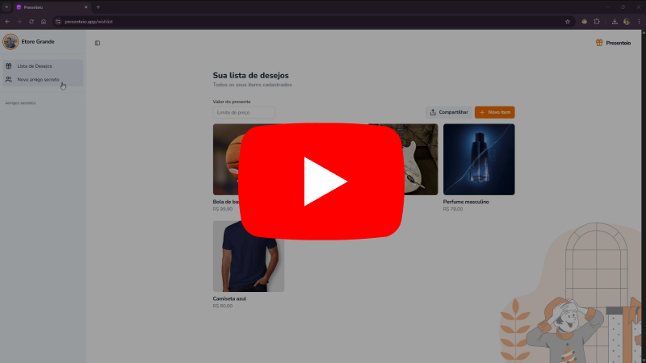

## 🎁 Presenteio

**[Presenteio](https://www.presenteio.app/)** é uma aplicação full-stack idealizada, projetada e desenvolvida inteiramente por mim. Construída com [Next.js](https://nextjs.org/), a plataforma permite a criação de listas de presentes personalizadas e também a criação de grupos para sorteio de amigo secreto.

## 🖼️ Demonstração

🎉 A aplicação já está no ar!  
Você pode testar todas as funcionalidades agora mesmo, em produção:

👉 **Acesse em:** [https://www.presenteio.app/](https://www.presenteio.app/)

🎥 **Ou assista ao vídeo demonstração:**    

## ✨ Principais funcionalidades
- 🛍️ CRUD completo de produtos:
  - Criar, editar, visualizar e excluir produtos com nome, descrição, link, preço, imagem e opção para alterar a visibilizade do produto na lista compartilhada;
  - ⬆️ Página específica para compartilhamento dos produtos cadastrados
- 🛍️ CRUD completo de grupos para amigo secreto:
  - Criar, editar, visualizar e excluir grupos para amigo secreto, com link para compartilhar e adicionar pessoas no grupo;
  - 💡 Regras de sorteio do amigo secreto que impedem um sorteio inválido (Quantidade de pessoas, sorteio pareado, etc)

- 🔐 Sistema de autenticação completo com **BetterAuth**, com cadastro, recuperação de senha, confiormação de cadastro por email, login social e controle de sessões;
- ✅ Validações robustas de formulários com Zod e React Hook Form;
- 📄 Banco de dados relacional **PostgreSQL** tipado e manipulado com **PrismaORM**;
- 📷 Armazenamento de imagens em bucket **AWS S3**

## 🧠 Tecnologias Utilizadas
- [Next.js](https://nextjs.org/)
- [React](https://reactjs.org/)
- [BetterAuth](https://www.better-auth.com/)
- [Tailwind CSS](https://tailwindcss.com/)
- [shadcn/ui](https://ui.shadcn.com/)
- [React Hook Form](https://react-hook-form.com/)
- [Zod](https://zod.dev/)
- [PrismaORM](https://www.prisma.io/)
- [PostgreSQL](https://www.postgresql.org/)

